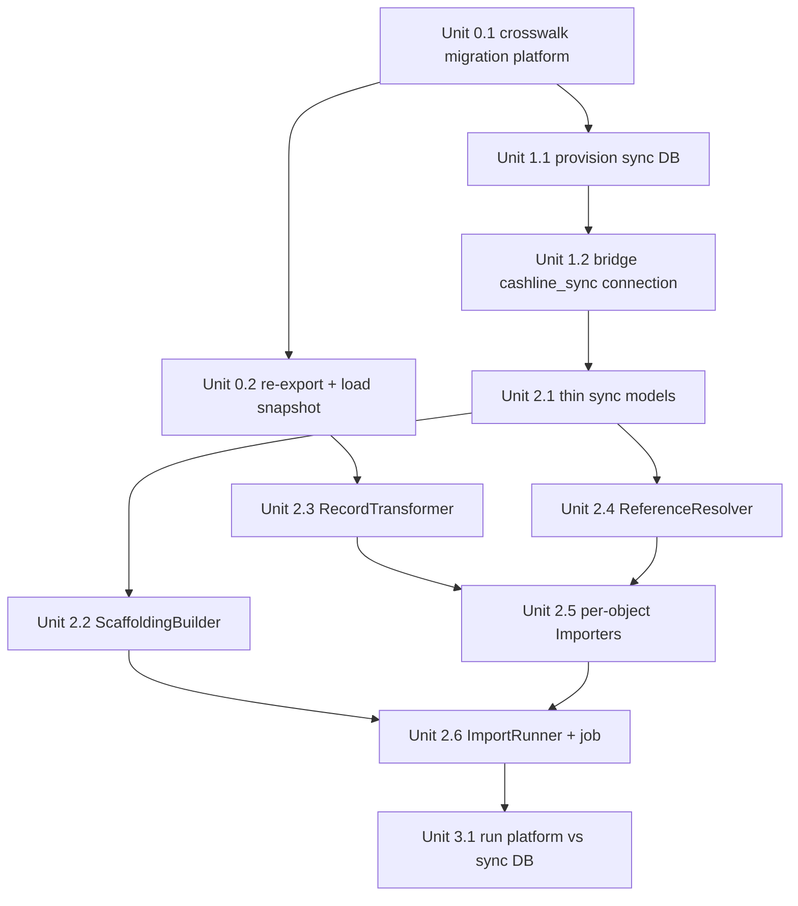

# feat: Sailfin → cashline-platform data importer + sync DB

> **This plan spans two repos.** Units are tagged **[platform]** (`~/Sites/cashline-platform`) or **[bridge]** (this repo, `cashline-ontology` / cashline-sailfin-bridge). All paths are repo-relative to the tagged repo.

## Overview

Stand up a pipeline that takes the full Sailfin download already sitting in the bridge's `sf_records` table, applies the committed mappings, and writes real cashline-shaped rows into a **new, schema-identical database** (`cashline-sailfin-sync-db`). Then point cashline-platform at that DB to *look at* real mapped data in the actual product UI — the fastest way to validate the mapping against reality and surface gaps.

The work splits into four phases:
- **Phase 0 [platform]** — add the `sailfin_*_id` crosswalk columns the importer needs to stash Salesforce IDs and resolve FKs.
- **Phase 1** — provision `cashline-sailfin-sync-db` (cashline schema, empty) and wire a 4th DB connection into the bridge.
- **Phase 2 [bridge]** — build the importer: transform engine + scaffolding + FK resolution + per-object orchestration. ← *the real work*
- **Phase 3 [platform]** — run cashline-platform against the sync DB and browse.
- **Phase 4** — *(deferred)* an in-app DB toggle, only if flip-in-UI ever beats running against the other DB.

Start with a **representative connected subgraph** (a few brands/accounts and everything hanging off them) so Phase 2 iterates fast, then scale to full volume.

## Problem Frame

The mapping workbench (see `docs/plans/2026-05-27-001-feat-cashline-sailfin-mapping-workbench-plan.md`) authored mappings and exported CSVs; that plan explicitly scoped the *test-import loop* as "built in cashline-platform, out of scope here." **This plan is that loop.** The user's actual goal is understanding: "import into cashline-platform, then look at the data in that platform to properly understand how it looks." Browsing real data in the real UI is the validation surface — it makes mapping gaps obvious in a way the field-map spreadsheet cannot.

The empirical findings from the full ~17.6M-row download (`docs/method/sailfin-to-cashline-field-map.md`) and the crosswalk-column design (`docs/method/sailfin-crosswalk-columns.md`) are the authoritative inputs.

## Requirements Trace

- **R1.** Add nullable, indexed `sailfin_*_id` crosswalk columns to the cashline-platform schema per the must-have list in `sailfin-crosswalk-columns.md`, so Salesforce IDs survive and FKs are re-resolvable.
- **R2.** Provision `cashline-sailfin-sync-db` as a byte-identical copy of the cashline schema (post-crosswalk), empty.
- **R3.** A bridge importer reads `sf_records` + committed `mapping_entries`/`mapping_value_entries` and writes cashline rows into the sync DB over a dedicated connection.
- **R4.** The importer satisfies every NOT NULL constraint — including cashline-only FKs with no Sailfin source — by synthesizing scaffolding rows.
- **R5.** The importer is **idempotent**: re-running upserts by `sailfin_*_id`, never duplicating.
- **R6.** The importer supports a **sample mode** (bounded connected subgraph) and a **full mode**.
- **R7.** cashline-platform can run locally against the sync DB with a usable login, and a human can browse imported invoices, accounts, disputes, etc.

## Scope Boundaries

- **Not** building a continuous/live sync. This is a repeatable batch import for exploration, not a production replication pipeline.
- **Not** changing the mapping workbench authoring UI, the suggestion engine, or the CSV export.
- **Not** importing every cashline-only construct. Tables with no Sailfin origin (`Ingestion::*`, `SubmissionArtifact`, `ExternalPortalStatus`, `InvoiceSubmission`, `InvoiceStatusEvent`, etc.) stay empty or get minimal scaffolding only where a NOT NULL FK forces it.
- **Not** merging the crosswalk migration to cashline-platform `main` yet (pending Dre's review) — it runs on a branch to provision the sync DB.

### Deferred to Separate Tasks

- **Phase 4 — in-app DB toggle** (Rails horizontal sharding + `DomainRecord` connection switching + operator settings UI): a separate plan, only if the run-against-the-other-DB workflow proves insufficient. Carries a known auth-pinning wrinkle (switching the whole connection switches the `users` table).
- **Render provisioning** of `cashline-sailfin-sync-db` as a managed service + a second web service: separate task once the local loop works. This plan provisions locally.
- **Crosswalk migration merge to platform `main`**: gated on Dre's review of `sailfin-crosswalk-columns.md`.

## Context & Research

### Relevant Code and Patterns

**[bridge]**
- `app/models/sf_record.rb` — Sailfin rows as JSONB `payload`, keyed `(extraction_run_id, object_api_name, sf_id)`. Read with `SfRecord.where(extraction_run_id:, object_api_name:).find_each`; fields via `record.payload["ApiName"]`.
- `app/models/mapping_entry.rb` — types `%w[direct value_collapse split derived dropped net_new]`; target stored as **natural keys** `(target_class, target_field)`; `source_field_id` nullable (net_new); `transformation_note`, `needs_crosswalk`.
- `app/models/mapping_value_entry.rb` — `source_value → target_enum_value`; sentinels `DROP = "__drop__"`, `DERIVE = "__derive__"`.
- `app/models/cashline_snapshot.rb` — JSON schema of cashline classes/columns incl. `enum_values` per column. Helpers: `.current`, `#field(class, field)`, `#enum_values(class, field)`. **This is how the importer resolves enum string → integer and validates targets exist.**
- `config/database.yml` — already declares 3 DBs (`primary`, `cache`, `audit`) via the abstract-connection pattern (`connects_to database: {...}`). The 4th (`cashline_sync`) follows the same shape (mirror `AuditRecord`).
- `app/services/mapping/csv_exporter.rb` — service shape to mirror (constructor-injected deps, pure transform).
- `app/jobs/extract_describe_job.rb`, `app/services/salesforce/record_exporter.rb` — job + per-object progress pattern (`data_exports` status rows, `update_all` with server-side JSONB), to mirror for import progress.
- `app/services/runs/relational_loader.rb` — existing batch JSONL→Postgres loader; closest precedent for batched writes.

**[platform]**
- `db/schema.rb` (format `:ruby`) — schema source of truth. Provision the sync DB with `db:schema:load`.
- `app/models/invoice.rb` — `recalculate_totals` (before_validation): `subtotal = Σ line amounts`, `total = subtotal + tax`, `balance_due = 0 if paid/closed/void else total`. **Bypassed on bulk import — the importer computes these itself.**
- 13 models call `audited` (Invoice, line items, disputes, etc.); Customer::Account, Customer::Group, User do not. **Bulk import must bypass `audited` + callbacks for volume.**
- `db/seeds.rb` — what the *seed* DB contains (1 operator, demo users, ~11 invoices). The sync DB starts empty + scaffolding instead.

### Key target-schema facts (NOT NULL FKs that force design)

| Table | NOT NULL FKs with **no Sailfin source** | Consequence |
|---|---|---|
| `invoices` | `client_group_id`, `created_by_user_id` | need synthetic default group + system user |
| `customer_accounts` | `client_group_id`, `client_organization_id` | synthetic default group; client org from Brand |
| `customer_organizations` / `client_organizations` | `operator_id` | single synthesized Operator |
| `invoice_disputes`, `payment_promises` | `client_group_id`, `created_by_user_id` | same scaffolding |
| `operational_tasks` | `operator_id`, `client_organization_id`, `created_by_user_id` | same scaffolding |
| `communication_events` | `client_group_id`, `created_by_user_id` | same scaffolding |

Enum integers (e.g. `invoices.status`: draft=0…closed=16; `customer_accounts.submission_channel`: unknown=0…mail=3) come from the snapshot's `enum_values`.

### Institutional Learnings

- `docs/method/sailfin-to-cashline-field-map.md` empirical findings drive transform rules: `Invoice.status` from `Amount_Outstanding__c` (95.9% zero → `paid`) + `Ecommerce_Category__c`; `InvoiceLineItem` synthesized 1:1 from Transaction (real `sfsrm__Line_Item__c` has 0 rows); `Contact.AccountId` empty in 27% of rows (orphan policy needed); corrected Brand_* field names; PaymentPromise = one per `(Payment, Payment_Line)`.
- `docs/method/questions-for-dre-bryce.md` already tracks the semantic questions this import will collide with (brand contact columns, etc.).

### External References

None required — this is an internal data-shape problem with strong local patterns (existing batch loaders, the snapshot, the abstract-connection precedent).

## Key Technical Decisions

- **Write over a dedicated `cashline_sync` connection from the bridge, using thin write-only AR models + `upsert_all`.** Rationale: the bridge already owns `sf_records` + mappings; a 4th connection mirrors the existing `AuditRecord` pattern. Thin models (no validations, no `audited`, no callbacks) give schema-aware, type-cast, idempotent bulk upsert at volume. The alternative (defining full cashline models, or running everything through AR validations/`recalculate_totals`) is too slow for millions of rows and couples the bridge to cashline model logic.
- **Compute derived values in the transform, not via cashline callbacks.** `recalculate_totals` is bypassed, so the importer sets `subtotal_cents/total_cents/balance_due_cents` itself (for 1:1 synthesized line items this is trivial). Status is derived from empirical signals.
- **Single-pass, parent-first FK resolution — not insert-then-resolve.** Because the NOT NULL FKs can't be filled later, the runner imports in dependency order, holding in-memory maps `sailfin_id → cashline integer id` for each parent table, and resolves child FKs at insert time. The `sailfin_*_id` crosswalk columns are still written (for re-resolvability across re-runs).
- **Synthesize scaffolding for cashline-only NOT NULL FKs:** exactly one Operator, one system import User (login-capable, with `OperatorMembership`), and one default `Client::Group` per `Client::Organization`. These are created idempotently before domain import.
- **Idempotency via `upsert_all(..., unique_by: <sailfin_*_id partial index>)`.** Re-runs replace in place.
- **Sample = connected subgraph, not random rows.** Sample mode selects N customer Accounts (e.g. by top brand) and imports only their accounts/contacts/transactions/disputes/payments — a referentially complete slice. Full mode imports everything.
- **Provision the sync DB from platform `schema.rb` on a crosswalk branch.** The sync DB needs the crosswalk columns in its loaded schema; it does not require the migration to be merged to platform `main`.

## Open Questions

### Resolved During Planning

- *Where does row data come from?* → `sf_records` JSONB (full download landed in commit `a9313db`).
- *In-app toggle now?* → No; deferred to Phase 4. Run-against-the-other-DB is the fast path.
- *Sample or full first?* → Sample (connected subgraph) first.
- *How to write into the cashline schema?* → 4th connection + thin models + `upsert_all`; derived values computed in transform.
- *How are enum integers known?* → from the re-exported `CashlineSnapshot`'s `enum_values`.

### Deferred to Implementation

- **Exact orphan policy** for `Contact.AccountId` empty (27%) and other dangling refs: drop the child, or attach to a synthetic "Unassigned" account? Decide when the sample surfaces real counts. *(Also a Dre/Bryce semantic question.)*
- **`invoice_number` source + uniqueness** within `client_group`: which Sailfin field (e.g. `Name`) and how to guarantee uniqueness per group. Confirm against real values during the sample run.
- **Money scale**: confirm Sailfin amounts are dollars → `*100` to cents (vs already-integer). Verify on real `Amount__c`/`Tax_Amount__c` values.
- **Whether the synthesized default `Client::Group` semantics are acceptable** to Dre/Bryce, or whether brands should map to groups differently — feeds `questions-for-dre-bryce.md`.

## High-Level Technical Design

> *This illustrates the intended approach and is directional guidance for review, not implementation specification. The implementing agent should treat it as context, not code to reproduce.*

**Pipeline shape:**

```
sf_records (JSONB, by object)            cashline_snapshot (target schema + enums)
        │                                          │
        └──────────────┬───────────────────────────┘
                       ▼
            RecordTransformer  ── applies MappingEntry/MappingValueEntry per target class
                       │            (direct / value_collapse / derived / split / net_new / dropped)
                       ▼
            ReferenceResolver  ── sailfin_id → cashline integer id (in-memory, parent-first)
                       │
                       ▼
   per-object Importers (fan-out + synthesis rules)
                       │
                       ▼
            upsert_all over `cashline_sync` connection (thin models)  →  cashline-sailfin-sync-db
```

**Dependency order + fan-out (what each Sailfin object becomes):**

| Sailfin object | → cashline target(s) | Rule |
|---|---|---|
| *(scaffolding)* | Operator, system User, OperatorMembership | created once, first |
| `User` (CashLine_Employee__c=true) | Operator personnel User + OperatorMembership | classifier field |
| `User` (CashLine_Employee__c=false) | Client::Contact + Client::Membership | classifier field |
| `Brand__c` *(via Account denorm)* | Client::Organization + default Client::Group | one group per org |
| `Account` | Customer::Organization **and** Customer::Account | dedup org by brand; account per (account × client) |
| `Contact` | Customer::Contact | orphan policy if AccountId empty |
| `sfsrm__Transaction__c` | Invoice **and** InvoiceLineItem (1:1) | status derived; totals computed |
| `sfsrm__Dispute__c` | InvoiceDispute | — |
| `sfsrm__Payment__c` × `sfsrm__Payment_Line__c` | PaymentPromise (one per line) | join via Payment_Line |
| `Task` / `EmailMessage` | OperationalTask / CommunicationEvent | per field-map signals |

**Build/run dependency graph:**



## Implementation Units

### Phase 0 — Crosswalk columns [platform]

- [ ] **Unit 0.1: Add `sailfin_*_id` crosswalk columns + indexes**

**Goal:** Give every cashline table with a Sailfin counterpart the nullable, indexed `sailfin_*_id` columns from the must-have list.

**Requirements:** R1

**Dependencies:** None.

**Files [platform]:**
- Create: `db/migrate/<ts>_add_sailfin_crosswalk_columns.rb`
- Modify: `db/schema.rb` (generated)

**Approach:**
- Add columns exactly per `docs/method/sailfin-crosswalk-columns.md` "Must-have for v1" list (Customer::Organization, Customer::Account, Customer::Contact, Client::Organization, Invoice, InvoiceLineItem, InvoiceDispute, PaymentPromise, User) plus the should-have CommunicationEvent/OperationalTask sets.
- Type `varchar(18)`, nullable. Single-column B-tree on each `sailfin_*_id`. Unique **partial** index where the doc marks "yes when set" (`WHERE col IS NOT NULL`). Composite unique on `customer_accounts (sailfin_account_id, client_organization_id)`.
- Runs on a feature branch in platform; not merged to `main` until Dre reviews.

**Patterns to follow:** Existing platform migrations in `db/migrate/`.

**Test scenarios:**
- Test expectation: none — additive schema-only migration. Verified by Unit 1.1 schema load succeeding and the unique partial indexes existing.

**Verification:** `db:migrate` then `db:rollback` is clean; `schema.rb` shows the new columns + partial indexes.

---

- [ ] **Unit 0.2: Re-export cashline schema snapshot and load into bridge**

**Goal:** Make the new crosswalk columns visible to the bridge as valid mapping targets and as enum/type metadata for the transformer.

**Requirements:** R1, R3

**Dependencies:** Unit 0.1.

**Files:**
- **[platform]** run existing `cashline:export_schema` rake task → JSON snapshot artifact.
- **[bridge]** load via existing `cashline:load_snapshot FILE=…` (creates a new `CashlineSnapshot`).

**Approach:** Procedural — no new code. Confirms `CashlineSnapshot.current` now includes `sailfin_*_id` columns and current `enum_values`.

**Test scenarios:**
- Test expectation: none — uses existing, tested rake tasks. Verified by asserting `CashlineSnapshot.current.field("Invoice", "sailfin_transaction_id")` is present.

**Verification:** New snapshot row in bridge; crosswalk columns queryable via snapshot helpers.

### Phase 1 — Provision the sync DB

- [ ] **Unit 1.1: Provision `cashline-sailfin-sync-db` (local) with cashline schema [platform]**

**Goal:** An empty Postgres DB structurally identical to the cashline schema (post-crosswalk).

**Requirements:** R2

**Dependencies:** Unit 0.1.

**Files [platform]:**
- Modify: `config/database.yml` (or document a `DATABASE_URL` override) for a `sync` target.
- Optionally: a documented script under `bin/` or notes in the plan; no app logic.

**Approach:** With the crosswalk branch checked out, `db:create` + `db:schema:load` against the new database (via a dedicated `DATABASE_URL`/config target). Result: all tables incl. crosswalk columns, zero rows. Render provisioning deferred (Scope Boundaries).

**Test scenarios:**
- Test expectation: none — infrastructure step. Verified by table/column counts matching the seed DB plus crosswalk columns.

**Verification:** `\dt` lists the full table set; `sailfin_*_id` columns present; row counts zero.

---

- [ ] **Unit 1.2: Add `cashline_sync` connection to the bridge [bridge]**

**Goal:** The bridge can write to the sync DB over a dedicated, named connection.

**Requirements:** R3

**Dependencies:** Unit 1.1.

**Files [bridge]:**
- Modify: `config/database.yml` — add `cashline_sync` under each env (mirror the `audit` block; host/db/user/password from ENV/credentials).
- Create: `app/models/cashline_sync_record.rb` — `abstract_class`, `connects_to database: { writing: :cashline_sync, reading: :cashline_sync }`.
- Modify: `config/credentials/*.yml.enc` and/or `.env` — sync DB connection params.

**Approach:** Mirror the existing `AuditRecord` abstract-connection precedent. No domain tables yet — just the base class + config.

**Patterns to follow:** The existing audit connection in `config/database.yml` and its abstract model.

**Test scenarios:**
- **Integration:** `CashlineSyncRecord.connection.execute("SELECT 1")` succeeds against the sync DB.
- **Integration:** a `SELECT count(*) FROM invoices` over the connection returns 0 (proves it's pointed at the empty sync DB, not the bridge primary).

**Verification:** A bridge console/connection smoke check reads from the sync DB.

### Phase 2 — The importer [bridge] (the real work)

- [ ] **Unit 2.1: Thin write-only sync models**

**Goal:** Schema-aware `upsert_all` targets for each cashline table, with no validations/callbacks/audits.

**Requirements:** R3, R5

**Dependencies:** Unit 1.2.

**Files [bridge]:**
- Create: `app/models/cashline_sync/` — one thin model per target table (e.g. `cashline_sync/invoice.rb`, `cashline_sync/customer_account.rb`, …) inheriting `CashlineSyncRecord`, each setting `self.table_name`.
- Test: `test/models/cashline_sync/thin_models_test.rb`

**Approach:** Models are intentionally bare (`table_name` only) so `upsert_all` works against the sync schema without dragging in cashline model logic. Namespaced under `CashlineSync::` to avoid colliding with any platform-derived names.

**Patterns to follow:** `AuditRecord` subclasses (abstract base + thin subclass).

**Test scenarios:**
- **Happy path:** `CashlineSync::Invoice.upsert_all([{…required cols…}], unique_by: :index_invoices_on_sailfin_transaction_id)` inserts a row into the sync DB.
- **Edge case:** re-running the same `upsert_all` updates in place (count unchanged) — proves the unique_by target resolves.

**Verification:** Round-trip a row through one thin model into the sync DB and read it back.

---

- [ ] **Unit 2.2: ScaffoldingBuilder**

**Goal:** Idempotently create the cashline-only rows that NOT NULL FKs require.

**Requirements:** R4

**Dependencies:** Unit 2.1.

**Files [bridge]:**
- Create: `app/services/sync/scaffolding_builder.rb`
- Test: `test/services/sync/scaffolding_builder_test.rb`

**Approach:** Create (idempotently): one Operator; one system import User (login-capable — known email + Devise-compatible `encrypted_password`) + its `OperatorMembership`; and, lazily, one default `Client::Group` per `Client::Organization` as orgs are imported. Expose lookups (`operator_id`, `system_user_id`, `default_group_for(client_org_id)`) the importers consume. The system user doubles as `created_by_user_id` everywhere a Sailfin owner can't be resolved.

**Test scenarios:**
- **Happy path:** first run creates exactly one Operator, one system User, one OperatorMembership.
- **Edge case (idempotent):** second run creates nothing new (counts stable).
- **Happy path:** `default_group_for` creates one Client::Group per Client::Organization and returns the same id on repeat calls.
- **Integration:** the system User can authenticate in cashline-platform (encrypted_password is Devise-valid) — checked in Unit 3.1.

**Verification:** After a run, the scaffolding rows exist once; lookups return stable ids.

---

- [ ] **Unit 2.3: RecordTransformer (mapping execution engine)**

**Goal:** Turn one `sf_record.payload` into a cashline attribute hash for a target class, by executing the committed mappings.

**Requirements:** R3

**Dependencies:** Unit 0.2 (snapshot with enums).

**Files [bridge]:**
- Create: `app/services/sync/record_transformer.rb` (+ optional per-type strategy objects under `app/services/sync/transforms/`)
- Test: `test/services/sync/record_transformer_test.rb`

**Approach:** Given a target class, gather its `MappingEntry` rows and apply by type: **direct** (copy `payload[source_api_name]`); **value_collapse** (look up `MappingValueEntry` for the raw value, with normalization for the 50+ `Ecommerce_System__c` variants; honor `__drop__`); **derived** (rule-based, incl. `Invoice.status` from `Amount_Outstanding__c` + `Ecommerce_Category__c`); **split** (fan one source to sibling targets); **net_new** (skip — no source); **dropped** (skip). Resolve enum string → integer via `snapshot.enum_values(class, field)`. Convert money fields to cents.

**Technical design:** *(directional)* a `transform(target_class, payload) -> { attrs:, sailfin_ids: }` returning both the column hash and the captured `sailfin_*_id` values, so Unit 2.4 can resolve FKs without re-reading the payload.

**Patterns to follow:** `app/services/mapping/csv_exporter.rb` (consumes the same `MappingEntry`/`MappingValueEntry`/snapshot trio).

**Test scenarios:**
- **Happy path (direct):** a populated source field copies to its target column.
- **Happy path (value_collapse):** a raw picklist value maps to its enum integer; an unmapped variant falls back per policy; a `__drop__` value yields nil.
- **Happy path (derived):** `Amount_Outstanding__c = 0` → status `paid` (integer 6); non-zero + `Ecommerce_Category__c` drives the documented secondary signal.
- **Edge case:** missing/blank source field → column omitted or default, never a crash.
- **Edge case (enum):** a value with no `enum_values` entry is flagged, not silently zero.
- **Edge case (money):** dollar amount → cents (`*100`), nil amount → 0 or omitted per column nullability.

**Verification:** Given a real `Account`/`Transaction` payload fixture, the produced hash matches expected cashline columns + enum integers.

---

- [ ] **Unit 2.4: ReferenceResolver (FK crosswalk)**

**Goal:** Resolve `sailfin_*_id` values to cashline integer FKs, parent-first, in memory.

**Requirements:** R4, R5

**Dependencies:** Unit 2.1.

**Files [bridge]:**
- Create: `app/services/sync/reference_resolver.rb`
- Test: `test/services/sync/reference_resolver_test.rb`

**Approach:** As each parent table imports, record `sailfin_id → assigned cashline id` (from the `upsert_all ... returning` ids, keyed by the parent's `sailfin_*_id`). Children look up their FK from these maps at insert time. Orphans (e.g. `Contact.AccountId` empty, or pointing at an unimported parent in sample mode) handled by the configured policy (drop vs synthetic-unassigned). NOT NULL FKs that resolve to nothing → row is rejected and counted, never inserted with a null.

**Test scenarios:**
- **Happy path:** a child with a known parent `sailfin_account_id` gets the correct integer `customer_account_id`.
- **Edge case (orphan, nullable FK):** empty source ref → FK left null where the column allows it.
- **Error path (orphan, NOT NULL FK):** unresolvable required FK → row excluded + recorded in the rejected count, not inserted.
- **Integration:** resolver maps survive across the parent→child ordering within one run (parent imported, then child resolves).

**Verification:** A two-table fixture (account → contact) resolves the child FK; an orphan contact is dropped/flagged per policy.

---

- [ ] **Unit 2.5: Per-object Importers (fan-out + synthesis)**

**Goal:** Encode the object→class rules: fan-out, 1:1 synthesis, classifier routing.

**Requirements:** R3, R4

**Dependencies:** Units 2.3, 2.4.

**Files [bridge]:**
- Create: `app/services/sync/importers/` — e.g. `account_importer.rb` (→ Customer::Organization + Customer::Account, + Client::Organization/default group via Brand), `user_importer.rb` (CashLine_Employee__c routing), `transaction_importer.rb` (→ Invoice + InvoiceLineItem 1:1, status + totals), `dispute_importer.rb`, `payment_importer.rb` (Payment × Payment_Line → PaymentPromise), `task_importer.rb`, `email_importer.rb`.
- Test: `test/services/sync/importers/*_test.rb`

**Approach:** Each importer composes the transformer + resolver + scaffolding, owns its fan-out, and returns row hashes ready for `upsert_all`. `transaction_importer` computes `subtotal/total/balance_due_cents` itself (callback bypassed) and synthesizes the single line item. `account_importer` dedups Customer::Organization by brand; creates the Customer::Account per (account × client) pairing and ensures the brand's Client::Organization + default Client::Group exist.

**Patterns to follow:** `app/services/salesforce/record_exporter.rb` (per-object batch shape).

**Test scenarios:**
- **Happy path (fan-out):** one `Account` payload yields a Customer::Organization **and** a Customer::Account with the right FKs.
- **Happy path (synthesis):** one `Transaction` yields an Invoice + exactly one InvoiceLineItem whose amount equals the invoice subtotal; totals consistent (`total = subtotal + tax`; `balance_due = 0` when status paid).
- **Happy path (routing):** `User` with `CashLine_Employee__c=true` → Operator personnel + membership; `false` → Client::Contact + Client::Membership.
- **Happy path (payment join):** a Payment with N Payment_Lines yields N PaymentPromise rows linked to the right invoices.
- **Edge case:** Account whose Brand is missing/unmapped → handled per orphan policy, doesn't abort the batch.
- **Integration:** importing Accounts then Transactions resolves `customer_account_id` on invoices via the shared resolver maps.

**Verification:** Fixture payloads for each object produce the expected cashline rows with resolved FKs.

---

- [ ] **Unit 2.6: ImportRunner + job + progress tracking**

**Goal:** Orchestrate the whole import — dependency order, sample/full mode, idempotent upserts, observable progress.

**Requirements:** R3, R5, R6

**Dependencies:** Units 2.2, 2.5.

**Files [bridge]:**
- Create: `app/services/sync/import_runner.rb`, `app/jobs/cashline_sync_import_job.rb`, `db/migrate/<ts>_create_sync_imports.rb` (per-object status/counts, mirroring `data_exports`), `lib/tasks/cashline_sync.rake` (CLI entry).
- Test: `test/services/sync/import_runner_test.rb`, `test/jobs/cashline_sync_import_job_test.rb`

**Approach:** Build scaffolding, then run importers in dependency order (Operators/Users → Client orgs/groups → Customer orgs → Customer accounts → Contacts → Invoices → line items → disputes → payments → comms/tasks). Batch each object with `find_each` + `upsert_all(unique_by: sailfin index)`. **Sample mode:** accept a selector (e.g. brand codes or an account-id list), import the referentially complete subgraph only. **Full mode:** everything. Track per-object status/counts in `sync_imports` (`update_all`, server-side, like `data_exports`). `audited`/callbacks never invoked (thin models). Re-runs are idempotent.

**Patterns to follow:** `app/jobs/extract_describe_job.rb` (error capture, `mark_failed!`, partial-failure recording); `data_exports` progress rows.

**Test scenarios:**
- **Happy path (sample):** given a 2-account selector, the runner imports those accounts + their contacts/transactions/disputes and nothing else; counts recorded in `sync_imports`.
- **Edge case (idempotent):** running twice leaves row counts identical (upsert, not duplicate).
- **Happy path (ordering):** parents always precede children; no NOT NULL FK violation occurs.
- **Error path:** a malformed object batch records a partial failure and continues other objects rather than aborting the run.
- **Integration:** after a sample run, the sync DB has a connected graph — every invoice's `customer_account_id`, `client_group_id`, `created_by_user_id` resolves to an existing row.

**Verification:** A sample run populates the sync DB end-to-end with referentially valid rows; re-run is a no-op on counts.

### Phase 3 — Look at the data [platform]

- [ ] **Unit 3.1: Run cashline-platform against the sync DB**

**Goal:** Browse real imported data in the actual product UI.

**Requirements:** R7

**Dependencies:** Unit 2.6.

**Files [platform]:**
- No app changes. Document a `DATABASE_URL`→`cashline-sailfin-sync-db` run procedure (e.g. notes appended to this plan or a `bin/` helper).

**Approach:** Start the app locally with `DATABASE_URL` pointed at the sync DB; log in as the synthesized system user (Unit 2.2). Browse invoices/accounts/disputes; capture mapping gaps; loop back to Phase 2. If login fails, confirm the system user's `encrypted_password` is Devise-valid (or seed one admin user into the sync DB).

**Test scenarios:**
- Test expectation: none — manual/exploratory verification. Captured as a checklist outcome below.

**Verification:** App boots against the sync DB; the system user logs in; invoice + account index/detail pages render real Sailfin-derived data; at least one mapping gap is identified and filed.

## System-Wide Impact

- **Interaction graph:** the importer **bypasses** cashline `before_validation`/`recalculate_totals` and `audited` callbacks by design — so derived columns must be set explicitly, and `audits` stays empty for imported rows. Confirm no read-path code in cashline-platform assumes an `audits` row exists.
- **Error propagation:** per-object partial failures are recorded and skipped, not fatal (mirrors `data_exports`); a failed connection or scaffolding error aborts the run early.
- **State lifecycle risks:** partial runs leave a referentially valid prefix (parent-first ordering); idempotent upsert means re-runs are safe. NOT NULL FK that can't resolve → row excluded, never a half-written graph.
- **API surface parity:** none — the bridge writes raw rows; it does not touch cashline-platform's HTTP/API surface.
- **Unchanged invariants:** the cashline-platform **schema and models are unchanged** except for additive nullable crosswalk columns (Unit 0.1). The seed DB and `db/seeds.rb` are untouched; the sync DB is a separate database. No existing cashline behavior changes.

## Risks & Dependencies

| Risk | Mitigation |
|------|------------|
| Crosswalk columns "pending Dre's review" block Phase 0 | Run on a platform feature branch; the sync DB only needs them in its loaded schema, not in `main`. |
| NOT NULL cashline-only FKs (`client_group_id`, `created_by_user_id`, `operator_id`) have no Sailfin source | ScaffoldingBuilder synthesizes Operator / system User / default Client::Group (Unit 2.2). Semantics flagged for Dre/Bryce. |
| Volume (~17.6M rows) too slow / OOM via AR | Thin models + `upsert_all` batches, `find_each`, no callbacks/audits; **sample mode first** to validate before full scale. |
| Orphan refs (27% empty `Contact.AccountId`, sample-mode dangling parents) | ReferenceResolver orphan policy (drop vs synthetic-unassigned); counts surfaced in `sync_imports`. |
| `recalculate_totals` bypass → wrong totals | Importer computes `subtotal/total/balance_due_cents` explicitly; 1:1 line-item synthesis keeps it trivial; verified in Unit 2.5 tests. |
| `invoice_number` uniqueness per `client_group` | Confirm source field + uniqueness during the sample run (deferred question). |
| Schema drift between platform and sync DB | Sync DB is re-provisioned from `schema.rb` + snapshot re-exported on any cashline schema change (Units 0.2, 1.1). |
| Devise login into an otherwise-empty sync DB | System user created login-capable; fallback seeds one admin (Unit 3.1). |

## Documentation / Operational Notes

- Append the local run procedure (sync `DATABASE_URL`, sample selector, login creds) to this plan or a short `docs/method/` runbook once Unit 3.1 settles.
- Feed orphan-policy and default-group-semantics findings back into `docs/method/questions-for-dre-bryce.md`.
- Render provisioning of the sync DB + a second web service is a separate follow-up (Scope Boundaries).

## Future Considerations

- **Phase 4 in-app toggle** (deferred): Rails horizontal sharding with a `DomainRecord` abstract class so domain tables switch DB per request while `users`/auth stay pinned to primary; an operator-only settings control selects the shard. Only worth building if running cashline-platform against the alternate DB proves too clumsy for the exploration workflow.

## Sources & References

- Field map + empirical findings: `docs/method/sailfin-to-cashline-field-map.md`
- Crosswalk column design (authoritative for Phase 0): `docs/method/sailfin-crosswalk-columns.md`
- Open semantic questions: `docs/method/questions-for-dre-bryce.md`
- Upstream workbench plan (this is its downstream import loop): `docs/plans/2026-05-27-001-feat-cashline-sailfin-mapping-workbench-plan.md`
- Full-download feature that produced `sf_records`: bridge commit `a9313db`
